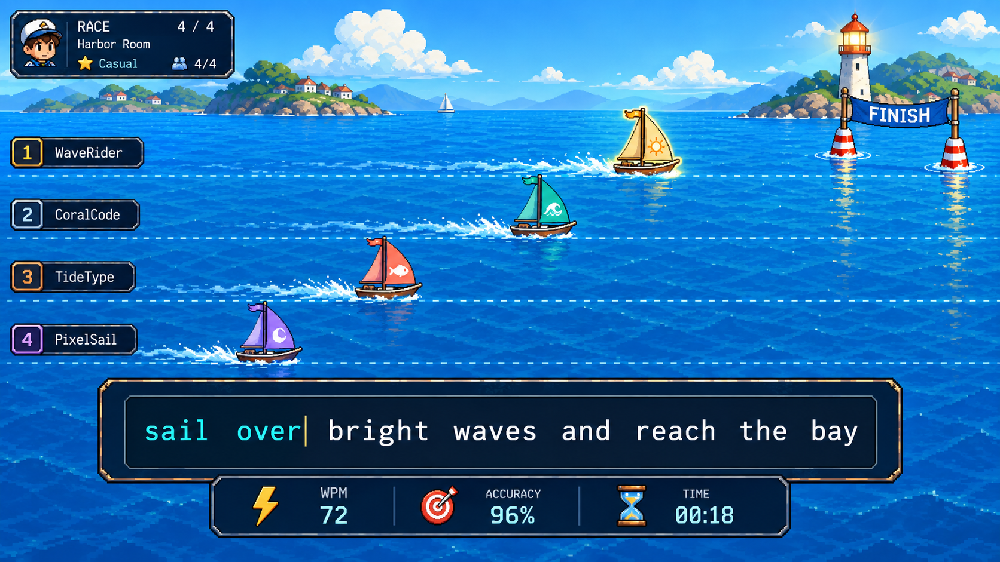
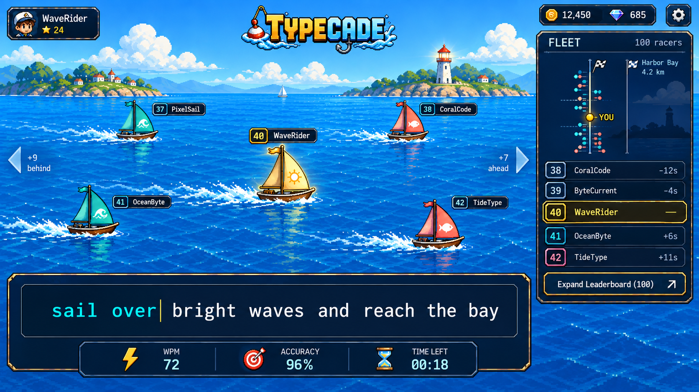
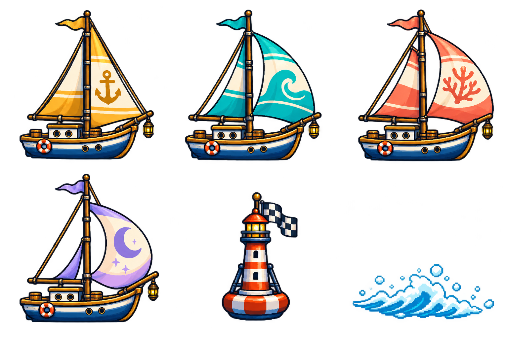

# Rencana perbaikan multiplayer Typecade: Ocean Race

**Status:** rancangan dan audit statis, 26 September 2026; implementasi yang berjalan tercatat terpisah di `docs/MIGRATION-LOG.md`.

**Cakupan dokumen:** rancangan multiplayer dan tiga gambar konsep di `docs/multiplayer-concepts/`.

**Acuan utama:** `docs/game-design(new).md`, `docs/art-bible.md`, `docs/MIGRATION-LOG.md`, dan `AGENTS.md`.

## 1. Keputusan produk

Multiplayer perlu mempertahankan inti yang jelas dari TypeRacer: semua peserta menerima teks yang sama, posisi lawan terbaca selama mengetik, masuk room tidak berbelit, dan hasil selesai dapat dipercaya. Identitas Typecade tetap Ocean Typing RPG. Pengganti mobil adalah **perahu layar nelayan kecil yang bergerak mengikuti arus laut**, dengan mercusuar buoy sebagai garis finis. Tidak ada aset, logo, atau tata letak TypeRacer yang disalin.

Prioritas urutannya adalah keadilan pertandingan, kejelasan konfigurasi, lalu presentasi. Animasi tidak boleh menjadi sumber kebenaran hasil. Gerak perahu membaca progres yang telah divalidasi; teks dan input tetap dominan.

Dokumen ini merupakan **rencana untuk fase setelah Milestone 0/1**, bukan izin mengimplementasikan server, Supabase Auth, ranked, atau `apps/game-server` pada cabang Ocean sekarang. `AGENTS.md` dan `docs/MIGRATION-LOG.md` secara eksplisit menahan fitur tersebut. Sebelum pekerjaan implementasi multiplayer dimulai, scope branch dan keputusan arsitektur harus diperbarui secara sadar. Kode multiplayer lama di root repo adalah bahan audit, bukan target otomatis untuk diperluas: source baru harus mengikuti `apps/web` dan `packages/*`.

Target visual 2–100 peserta di bagian bawah adalah perluasan dari desain Ocean saat ini yang baru merencanakan 1v1 lalu 3–5 pemain. Target tersebut belum menggantikan batas tahap implementasi atau menjadi janji kapasitas server.

## 2. Dasar audit dan batas kesimpulan

Audit ini membaca source, skema yang tersedia, dan spesifikasi. Tidak ada room langsung dengan dua akun yang dijalankan. Jadi temuan bertanda **pasti dari kode** adalah perilaku yang terlihat dari alur dan rumus; temuan bertanda **perlu reproduksi** adalah risiko akibat race condition, jaringan, atau konfigurasi deployment. Tidak ada klaim bahwa seluruh bug sudah direproduksi di browser.

| Area | Bukti di repo | Temuan dan dampak | Status |
|---|---|---|---|
| Platform | `AGENTS.md`; `docs/MIGRATION-LOG.md:40`; `features/multiplayer/*`; `app/(main)/race/*` | Aplikasi Ocean Vite dan mode multiplayer Next lama hidup berdampingan. Pekerjaan baru di root Next akan melanggar aturan migrasi. | Pasti |
| Pilihan room | `features/multiplayer/components/lobby.tsx:46-50` | UI mode memakai label, lalu mengubah semua `Words` menjadi 50 dan semua `Time` menjadi 60. Jumlah kata dan waktu lain tidak tersimpan. | Pasti |
| Paritas practice | `app/(main)/client.tsx:28-34,69-76,640-680`; `features/typing/components/typing-area.tsx:16-42` | Practice punya Quote Easy/Medium/Hard, Words 10/25/50/100/custom 1–1000, Time 15/30/60/120/custom 1–3600, Custom Text/shuffle, EN/ID, punctuation, numbers. Room hanya mengirim bahasa serta Time/Words 60/50. | Pasti |
| Teks yang dibagikan | `features/multiplayer/hooks/use-room-data.ts` dan `use-room-channel.ts:189-205` | Saat join, teks dibuat dari seed `room.code`; saat start, dibuat dari `code + updated_at`. Peserta yang masuk ketika status sudah racing dapat melihat teks berbeda dari peserta yang menerima event start. | Pasti dari dua jalur kode; dampak perlu reproduksi |
| Progres dan finis | `features/multiplayer/components/race.tsx:129-139,339-350` | Progres memakai perkiraan `jumlah kata × 5`, bukan panjang teks aktual. Race Words dapat selesai sebelum teks selesai atau belum selesai saat teks habis. Race Time juga diberi target karakter semu dan dapat finis dini. | Pasti |
| Status match | `features/multiplayer/components/race.tsx:279-288` | Host mengubah seluruh room menjadi `finished` ketika state dirinya selesai. Lawan berisiko dipaksa selesai sebelum waktunya. | Pasti dari kode; timing perlu reproduksi |
| Hasil | `features/multiplayer/components/race-results-modal.tsx` | Hasil diurutkan berdasarkan WPM, sedangkan desain Ocean menetapkan progres tervalidasi, accuracy, lalu timestamp. Peringkat yang ditampilkan bisa berbeda dari pemenang yang dimaksud. | Pasti |
| Fallback | `features/multiplayer/hooks/use-room-data.ts` dan `race.tsx:33-42,100-113` | Tanpa room/auth/backend, halaman race memulai simulasi bot. Fallback ini bisa terasa seperti pertandingan manusia dan menyembunyikan masalah koneksi. | Pasti |
| Kepercayaan data | `features/multiplayer/hooks/use-live-player-sync.ts`; `use-room-channel.ts:223-229` | Browser mengirim WPM, progress, correctChars, status sendiri; penerima menerimanya tanpa validasi rule server. Tidak layak untuk ranked atau hadiah. | Pasti |
| Kehadiran | `use-room-channel.ts:231-240,260+`; `use-room-registry.ts` | Presence `leave` langsung menghapus player row; `pagehide` mengirim DELETE dengan anon key. Putus sesaat, tab berpindah, dan sesi auth berisiko membuat pemain hilang atau row tertinggal. | Perlu reproduksi dan audit RLS |
| Join | `features/multiplayer/components/lobby.tsx:170-201` | Query join hanya meminta `id, code`; tidak terlihat cek `status`, privasi, kapasitas, atau larangan join saat match berjalan sebelum upsert. | Pasti dari client; DB constraints belum diverifikasi |
| Countdown | `features/multiplayer/hooks/use-race-timer.ts`; `use-room-channel.ts:127-153` | Timer UI memakai local `Date.now()` dan tick countdown lokal. Drift clock atau event yang terlambat berpotensi membuat start tidak serempak. | Perlu reproduksi |
| Input | `features/multiplayer/components/race.tsx:73-82`; `features/typing/hooks/use-typing-engine.ts`; `packages/typing-engine/src/index.ts` | Race lama memakai engine legacy berbasis string input; engine Ocean berbasis key event dan aturan backspace berbeda. Satu definisi validasi harus dipilih untuk semua klien dan server. | Pasti |
| Acak | `features/multiplayer/components/race.tsx:202-228`; `lib/words.ts:315+` | Bot memakai `Math.random()`. Generator kata lama juga memakai `Math.random()` saat tanpa seed. Ini bertentangan dengan aturan RNG gameplay yang deterministik. | Pasti |

**Urutan perbaikan bug:** satu teks untuk semua peserta → progres/finis/hasil → lifecycle room dan reconnect → input/validasi → UI konfigurasi → visual. Rencana tidak mengandalkan skema Supabase lama yang belum terlihat lengkap dalam migration repo.

## 3. Sasaran dan kriteria selesai

1. Pemain bisa membuat room private atau public, membagikan kode/link, melihat aturan sebelum masuk, siap, lalu mengetik dengan fokus yang jelas. Tidak ada bot yang disamarkan sebagai orang. Presentasi harus dapat diskalakan dari 2 hingga target desain 100 peserta tanpa mengecilkan area mengetik.
2. Konfigurasi match mencakup seluruh pilihan practice yang relevan. Setiap peserta melihat konfigurasi final yang sama dan tidak dapat mengubahnya setelah semua siap/start.
3. Setiap peserta mendapat teks dan urutan karakter yang identik dari `contentVersion + seed + config`; server menyimpan hash teks final. Tidak ada generate ulang bebas di sisi klien saat reconnect.
4. Posisi resmi bersumber dari karakter yang diterima server. Posisi tampilan boleh memprediksi sebentar, tetapi tidak boleh melompati state resmi atau mundur secara mencolok.
5. Match Time selesai karena timer bersama habis; match Words/Quote/Custom selesai setelah teks valid selesai atau batas keamanan tercapai. Tidak ada rumus `kata × 5` sebagai penentu finis.
6. Hasil menyebut pemenang, alasan menang, progress, gross/net WPM, accuracy, waktu, dan status DNF/disconnect. Seri mengikuti aturan yang tertulis.
7. Reconnect dalam jendela singkat memulihkan match yang sama, input yang tervalidasi, dan posisi; hasil hanya diproses satu kali.
8. Pada viewport sempit dan reduced motion, pengguna tetap bisa mengetik dan membaca lawan tanpa adegan 3D.

## 4. Konfigurasi room: setara practice

**Prinsip UI:** pilih `Format teks` dahulu, kemudian `Varian tantangan`. Pengaturan personal seperti suara, ukuran teks, kontras, dan efek visual dapat berbeda per peserta; aturan pertandingan tidak. Host melihat ringkasan yang persis sama dengan kartu room yang dilihat tamu.

| Pengaturan | Pilihan dari practice saat ini | Rencana multiplayer | Validasi dan catatan |
|---|---|---|---|
| Bahasa | English / Bahasa Indonesia | EN atau ID untuk seluruh room | Tidak mencampur bahasa dalam satu race; konten ID berada di content pack, UI tetap English sesuai aturan arsitektur. |
| Format Words | 10, 25, 50, 100, Custom | Semua pilihan, termasuk bilangan custom | Room private/casual menerima penuh 1–1000 seperti practice. Room publik boleh memiliki batas antrean yang lebih pendek dan harus menampilkannya sebelum pemain memilih. Default 50. |
| Format Time | 15, 30, 60, 120 detik, Custom | Semua pilihan, termasuk custom | Room private/casual menerima penuh 1–3600 detik seperti practice, dengan label estimasi durasi dan batas idle server. Room publik boleh memiliki batas antrean yang lebih pendek dan harus menampilkannya. Default 60 detik. |
| Format Quote | Easy, Medium, Hard | Semua tingkat untuk EN/ID | Pilih quote dari manifest berlisensi/ditulis sendiri. Simpan `quoteId` dan hash, bukan generate pada tiap klien. |
| Format Custom Text | teks bebas + shuffle | Host dapat memasukkan teks dan mengaktifkan shuffle kata | Hanya room private/casual pada fase awal. Tampilkan preview final ke semua peserta, limit karakter, sanitasi, report/mute, tanpa teks ofensif di lobby publik. Shuffle menggunakan seed server. |
| Punctuation | on/off pada Words/Time | Paritas penuh pada Words/Time | Penerapan identik untuk semua pemain; tampil di badge room. Quote/Custom mengikuti teks aslinya. |
| Numbers | on/off pada Words/Time | Paritas penuh pada Words/Time | Sama seperti punctuation. |
| Typing style | pilihan personal di practice | Preferensi tampilan/input yang kompatibel | Jangan menjadi rule kompetitif. Semua style harus memetakan input ke engine yang sama; opsi yang tidak kompatibel dinonaktifkan dengan alasan. |
| Opsi aksesibilitas | pengaturan personal | Reduced motion/effects, kontras, font/ukuran, mute | Selalu personal; tidak mempengaruhi skor. |

Skema konseptual `RoomConfig v1`: `language`, `textMode`, `textValue`, `punctuation`, `numbers`, `quoteDifficulty`, `customTextId`, `customShuffle`, `challenge`, `challengeParams`, `visibility`, `maxPlayers`, `contentVersion`, `seed`, `textHash`, `rulesVersion`. Field yang tidak berlaku bernilai null. Host dapat mengedit saat status `waiting`; edit me-reset semua tanda siap dan menaikkan `configVersion`. Semua peserta harus mengakui versi terbaru sebelum start. Setelah countdown dimulai, config immutable. Pilihan kapasitas 2–100 adalah target desain bertahap: UI hanya membuka ukuran yang sudah lolos uji kapasitas. Room 100 peserta terlebih dahulu bersifat casual; ranked tetap memakai ukuran dan preset yang terkontrol.

**Preset yang tampil pertama:** `Classic 50 words`, `Short 25 words`, `Timed 60s`, `Perfect Tide 50 words`, lalu `Advanced settings`. Preset hanya pintasan; semua parameter tetap bisa ditinjau. Jangan menyembunyikan konfigurasi final di bawah nama preset.

## 5. Varian tantangan

Varian hanya mengubah aturan typing/penilaian. Aset perahu, skill expedition, item, dan statistik RPG tidak memberi bonus kompetitif.

| Varian | Aturan | Hasil/UX | Tahap |
|---|---|---|---|
| **Classic Current** | Salah ketik tidak menambah progress; pemain mengetik ulang karakter yang benar. Perahu tidak mundur. | Yang mencapai akhir teks lebih dulu menang; pada Time, progress tervalidasi tertinggi. | 1 |
| **Perfect Tide** | Salah satu keystroke salah mengakhiri upaya pemain saat itu; ini adaptasi ide *Instant Death* TypeRacer. | Perahu berhenti dan diberi label `Out — typo`, pemain boleh spectate; match tetap berjalan sampai ada pemenang/batas waktu. Jangan auto-kick dari room. | 2 |
| **Three Hulls** | Setiap typo mengurangi satu dari tiga peluang. Pada nol, pemain out. | Lebih ramah daripada Perfect Tide; peluang tampak sebagai tiga ikon lambung dengan teks angka. | 2 |
| **Clean Streak** | Progress tetap seperti Classic, tetapi hasil kedua/seri memakai rentetan kata bersih sebagai tie-break yang diumumkan. | Visual wake tumbuh ketika streak naik; tidak ada buff kecepatan tersembunyi. | 3 |
| **Tide Checkpoints** | Passage dibagi menjadi beberapa sektor berukuran sama. Posisi resmi terus berjalan; papan menampilkan split time per sektor. | Menambah sasaran jangka pendek tanpa mengubah aturan benar/salah. | 3 |
| **Relay Crew** | Tim 2v2; tiap anggota menyelesaikan sektor bergantian; pergantian server-side setelah checkpoint. | Varian party sesudah 1v1/3–5 player stabil; perlu desain AFK dan tim tak seimbang. | Lanjutan |

Aturan Perfect Tide harus menyebut **keystroke pertama yang tidak cocok** sebagai pemicu, bukan accuracy di akhir. Paste, input sintetis, komposisi IME, dan shortcut harus mempunyai kebijakan sama di klien dan server. Jika semua pemain out, tampilkan `No finisher`; peringkat ditentukan oleh karakter benar lalu waktu out, tanpa memberi kemenangan palsu. Untuk Classic, tie-break Ocean adalah progress tervalidasi, accuracy, lalu completion timestamp. Jika tetap sama, nyatakan seri. Untuk ranked mendatang, konfigurasi dibatasi ke preset yang dapat dibandingkan dan tervalidasi; Custom Text/varian eksperimental tidak masuk rating.

## 6. Alur UX yang harus dirancang

### Lobby dan membuat room

Layar pertama menyediakan tiga tindakan jelas: `Quick race`, `Create room`, `Join by code`. Quick race tidak ditampilkan sebagai multiplayer sungguhan sebelum matchmaking tersedia. Daftar room menampilkan bahasa, format, jumlah kata/waktu, varian, pemain `2/4`, status, dan perkiraan durasi. Filter bahasa, varian, dan jumlah pemain; empty state memberi tindakan yang berfungsi. Room private tidak muncul dalam daftar. Validasi kode dilakukan sebelum navigasi; kode salah, room penuh, dimulai, atau kedaluwarsa diberi pesan berbeda.

Form host satu panel: (1) format teks, (2) opsi teks, (3) varian, (4) visibilitas dan kapasitas, (5) ringkasan. Tampilkan dampak parameter secara langsung: `50 words · ID · punctuation off · Classic · 2–4 players`. Nilai custom tidak boleh kembali menjadi default diam-diam. UI memiliki satu tombol utama `Create room`; setelah berhasil, kode/link dan status koneksi terlihat.

### Waiting room

Daftar pemain memperlihatkan `Connected / Reconnecting / Ready`; host mempunyai hak `Start` setelah minimal dua pemain nyata dan semua peserta siap. Tamu tidak dapat mengetik saat countdown. Perubahan aturan oleh host membatalkan ready, memunculkan ringkasan perubahan, dan memerlukan ready ulang. Saat host keluar, transfer host atau tutup room dilakukan oleh otoritas room, bukan oleh klien tersisa. Berikan `Copy invite` dengan feedback dan fallback jika clipboard gagal. Nama pemain tidak boleh menggeser layout saat panjang.

### Race aktif

Bagian layar prioritas: teks/input (terbesar), posisi perahu dan nama peserta, lalu timer/WPM/accuracy. Teks berkontras tinggi, cursor stabil, dan error terlihat tanpa menggoyang panel. Untuk 2–5 pemain, semua perahu dapat terlihat. Untuk room besar, kamera mengikuti progres pemain dan hanya menampilkan lawan yang dekat; jangan membuat 100 jalur permanen atau memindahkan kapal ke jalur baru setiap kali ranking berubah. Pemain sendiri selalu mudah ditemukan dengan label `You` dan bentuk outline khusus. Posisi lawan bergerak mulus berdasarkan snapshot; jika koneksi hilang, tampilkan `Reconnecting…` dan status terakhir yang diketahui tanpa berpura-pura live. Indikator latency hanya ditampilkan jika memang diukur.

Race Time menampilkan sisa waktu dan progress sebagai **jumlah karakter benar + posisi relatif terhadap peserta**, bukan garis finis palsu pada karakter target semu. Race Words/Quote/Custom menampilkan progress `validatedChars / targetLength`; jarak visual antarperahu mengikuti persentase itu. Pada 100%, perahu mencapai buoy. Typo memicu hambatan wake singkat, bukan gerak mundur. Jangan gunakan shake, flash, atau partikel di atas target teks.

### Akhir pertandingan

Hasil adalah layar yang tetap bisa dibaca, bukan modal yang langsung menutup seluruh konteks. Tunjukkan tempat, waktu atau karakter benar, net WPM, accuracy, typo, alasan DNF, status `verified/provisional`, dan aturan tie-break. Setelah finish sendiri, pemain tetap dapat spectate sampai match selesai atau memilih keluar. `Rematch` membutuhkan ready ulang, seed/teks baru, dan config tetap kecuali host mengubahnya. Hasil tidak boleh diurutkan berdasarkan WPM jika kemenangan ditentukan oleh finish/progress.

### Kondisi jaringan dan aksesibilitas

Sediakan status eksplisit: `connecting`, `ready`, `countdown`, `racing`, `reconnecting`, `finished`, `cancelled`, `expired`. Reconnect 10–20 detik adalah target awal untuk diuji, bukan janji tanpa pengukuran. Jika server mati sebelum start, match dibatalkan tanpa hasil. Saat tab tersembunyi, timer resmi tetap berjalan; pengguna diberi status saat kembali. Keyboard fokus dipulihkan setelah modal/overlay, tetapi tidak mencuri fokus dari kontrol pengguna. Semua tombol dapat dipakai tanpa pointer; perubahan posisi tidak diumumkan tiap frame ke screen reader. Reduced motion mengganti perahu bergerak dengan marker posisi statis dan pembaruan angka berkala.

## 7. Visual dan aset yang dibuat sekarang







**Konsep awal:** empat perahu di empat arus laut horizontal menuju buoy mercusuar. Ini cocok untuk room kecil, tetapi tidak menjadi layout baku bagi 10–100 peserta. **Konsep skala besar:** kamera menahan perahu sendiri dekat tengah panggung, menampilkan beberapa rival yang relevan dan penanda lawan di luar layar. Panel kanan menampilkan posisi diri beserta tetangga ranking, distribusi progres seluruh armada, dan tombol daftar lengkap. Bagian bawah tetap panel teks besar dengan chrome navy dan aksen emas yang konsisten dengan `docs/reference/typecade-ui-reference.jpg` dan `docs/art-bible.md`. Kedua gambar hanya untuk komposisi dan mood: letak kapal, angka ranking, jarak waktu, WPM, dan contoh teks pada gambar belum dihitung dari data pertandingan dan **tidak boleh dijadikan spesifikasi aturan**. Implementasi UI tetap memakai teks DOM agar aksesibel dan tajam.

**Lembar aset:** empat perahu dengan palet gold/teal/coral/lavender, buoy finis, dan wake. PNG memiliki kanal alpha, tetapi masih berupa **concept sheet**: belum dipotong menjadi sprite, belum diaudit tepi/alpha tiap objek, belum dibuat frame animasi, pivot, atlas, atau model 3D. Bentuk lambung dan layar perlu diseragamkan pada tahap produksi. Siluet harus tetap terbaca saat 64–96 px; warna tidak boleh menjadi satu-satunya pembeda pemain.

**Daftar aset produksi kelak:** (a) empat perahu side view dalam satu template hull dengan variasi layar dan palet yang dapat dipakai ulang untuk lebih banyak peserta, (b) buoy start/finish, (c) wake normal/typo/streak, (d) arus laut dan penanda checkpoint, (e) emblem varian, (f) ilustrasi empty/reconnect yang tidak menghalangi input. Identitas 100 pemain harus berasal dari nama, nomor, bentuk/ikon, dan pola layar; warna saja tidak cukup dan tidak perlu 100 aset unik. Tidak ada avatar 3D kompleks atau air fisik volumetrik.

### Kamera dan informasi untuk 2–100 pemain

Usulan pengguna untuk membuat kamera mengikuti kenaikan pemain **tepat pada tujuannya**: perhatian tetap pada diri sendiri dan rival yang sedang disalip. Namun, kamera yang berpindah vertikal mengikuti nomor ranking setiap kali urutan berubah akan membuat kapal seolah teleport, memperberat orientasi, dan mengguncang area membaca teks. Gunakan **progres di lintasan sebagai koordinat kamera**, sementara ranking menjadi lapisan informasi yang terpisah. Jika tema Treasure Dive kelak bergerak ke bawah laut, kamera boleh mengikuti kedalaman/progres secara vertikal; aturan world-space tetap sama. Ranking berubah tanpa memindahkan seluruh dunia.

- **Kamera utama:** tempatkan perahu diri sekitar 40–45% lebar panggung. Kamera mengikuti progresnya dengan easing dan batas percepatan; jangan mengejar tiap keystroke mentah. Jarak lawan di dunia dihitung dari selisih progres tervalidasi. Lawan yang terlalu jauh diganti penanda tepi `+N ahead / +N behind`, bukan disusutkan sampai tidak terbaca. Pada finis, kamera berhenti mengikuti dan memperlihatkan buoy/hasil.
- **Pemilihan rival:** tampilkan maksimal 4–6 kapal dekat pemain berdasarkan *jarak progres*, dengan pilihan stabil selama beberapa detik agar kapal tidak sering keluar-masuk panggung. Prioritaskan satu atau dua tepat di depan dan belakang. Nomor urut tidak boleh menjadi satu-satunya dasar pemilihan: pada 100 pemain, dua ranking bersebelahan dapat berjauhan secara progres.
- **Leaderboard ringkas:** tampilkan `rank / total`, diri sendiri, sekitar 2–3 ranking di atas dan bawah, serta pemimpin/finisher bila relevan. Urutan numerik boleh berubah, tetapi animasi perpindahan baris harus singkat dan dapat dimatikan. Jangan mengganti nama yang sedang dibaca beberapa kali per detik; pembaruan panel sekitar 1–2 Hz cukup untuk prototipe.
- **Minimap armada:** ini peta **distribusi progres**, bukan daftar 100 nama. Marker diri dan peserta yang dipin ditampilkan jelas; peserta lain dikelompokkan ke bin progres sehingga tumpukan 100 titik tidak menjadi satu noda. Jumlah dalam tiap kelompok bisa ditampilkan saat hover/focus. Tombol `Full leaderboard` membuka daftar lengkap yang dapat dicari dan digulir, dengan baris virtual bila jumlah besar.
- **Jumlah adaptif:** 2–5 pemain: semua kapal dan nama terlihat; 6–12: diri + rival dekat di panggung, seluruh peserta dapat masuk panel ringkas bila ruang cukup; 13–100: diri + maksimal 4–6 rival, panel lokal, minimap agregat, daftar lengkap dalam overlay. Ini adalah *target desain*, bukan klaim bahwa backend sekarang mampu menampung 100.
- **Mobile:** area teks tetap dominan. Panggung memperlihatkan diri + paling banyak dua rival; panel hanya `rank / total` dan dua tetangga, minimap ringkas dapat dibuka. Daftar lengkap berupa sheet yang tidak otomatis muncul saat mengetik. Jangan zoom out sampai teks dan kapal menjadi kecil.
- **Konsistensi data:** posisi visual memakai snapshot resmi + interpolasi lokal, sedangkan ranking final memakai state server. Jika snapshot terlambat, tampilkan status data tertunda; jangan menampilkan lompatan ranking sebagai kepastian sebelum dikonfirmasi. Untuk mode Time, label selisih sebaiknya karakter/progres, bukan perkiraan detik yang berubah liar.

Skala 100 juga mengubah beban jaringan. Model mengirim tiap input ke 99 penerima tidak layak. Server perlu menerima input dalam batch kecil, menyebarkan snapshot posisi lawan terdekat lebih sering, serta ringkasan leaderboard/minimap lebih jarang. Jumlah pemain yang terlihat di panggung dibatasi tanpa mengurangi jumlah peserta pertandingan. Uji kapasitas, biaya, latensi, dan fairness pada 2, 10, 30, dan 100 klien simulasi sebelum membuka ukuran room tersebut. Kuota free tier yang tercantum di bawah **tidak membuktikan** room 100 peserta dapat berjalan gratis dan stabil.

### Pilihan renderer untuk balapan

**Rekomendasi tahap pertama: Phaser 4 2D**, karena Ocean sudah memakainya dan art bible mengunci bahasa side view pixel-inspired. Ini menghemat berat bundle, menjaga satu game canvas, dan cocok untuk sprite atlas, bounded particles, dan fallback reduced effects. **Three.js adalah eksperimen opsional**, bukan syarat race: hanya jika tes prototipe 2.5D membuktikan kedalaman air/lighting lebih baik tanpa menurunkan keterbacaan atau performa. Jangan menumpuk Phaser dan Three dalam satu race aktif. Render hanya menerima domain event `validatedProgress`, `typo`, `checkpoint`, `finish`; React tidak menyentuh scene internals.

Untuk prototipe 2.5D, aset perahu dapat dibuat sederhana di Blender dan diekspor ke glTF/GLB, atau sprite pada plane. Gunakan kamera orthographic hampir side-on, air berlapis datar, pencahayaan lembut, tanpa postprocessing berat. Baca skill `threejs-fundamentals`, `threejs-materials`, `threejs-lighting`, `threejs-animation`, `threejs-loaders`, dan `threejs-postprocessing` dari repositori [CloudAI-X/threejs-skills](https://github.com/CloudAI-X/threejs-skills) saat prototipe dimulai. Repositori tersebut adalah panduan implementasi MIT, **bukan penyedia aset perahu siap pakai**. Cocokkan API dengan dokumentasi Three.js saat itu.

## 8. Arsitektur yang direncanakan untuk fase multiplayer

```
React/Vite (room UI, input, accessibility, local preferences)
  → typed input events + room commands
  → authoritative room service (config, shared text, clock, validation, presence, result)
  → validated domain snapshots/events
  → React HUD + one lazy-loaded renderer (Phaser 2D atau eksperimen Three.js)
packages/typing-engine + packages/game-rules + packages/contracts + packages/content
```

Server memilih `seed` dan `contentVersion`, membangun teks sekali, menyimpan text/hash, lalu membagikannya dalam snapshot room. Input dikirim sebagai event kecil dengan sequence per pemain; server memeriksa urutan, karakter, rate limit, dan state match. Klien memprediksi cursor lokal untuk responsivitas, lalu rekonsiliasi ke progress tervalidasi. Broadcast posisi cukup 5–10 Hz, animasi lokal dapat 60 fps tanpa mengirim 60 pesan/detik. Semua timer memakai `startsAt` dan `endsAt` resmi, dengan offset jam klien yang diukur; `updated_at` generik tidak dipakai sebagai start timestamp. Event hasil memakai `matchId + playerId + rulesVersion` untuk idempotensi. Room memiliki TTL dan jalur cleanup server-side.

**Pilihan backend gratis untuk prototipe publik:** Cloudflare Workers + SQLite-backed Durable Object per room. Dokumentasi Cloudflare menyatakan Durable Objects tersedia pada Free, termasuk WebSocket dan storage SQLite, dengan batas yang dapat membuat operasi gagal ketika terlampaui. Ini cocok untuk pembuktian room kecil dan hibernasi koneksi; kapasitas room 100 **belum terbukti**. Rencana ini **menyimpang dari preferensi Colyseus** dalam `docs/game-design(new).md:288-304`, sehingga harus dicatat sebagai keputusan arsitektur saat scope multiplayer dibuka. Colyseus tetap kandidat jika ada host Node gratis yang teruji untuk beban aktual atau saat anggaran tersedia; lisensi library tidak sama dengan hosting gratis. Jangan menyebut ranked siap produksi hanya karena room bisa berjalan pada free tier.

Supabase Free dapat dipakai nanti untuk akun, profil, dan hasil yang sudah diverifikasi jika keputusan milestone mengizinkan. Supabase Realtime saja tidak boleh menjadi otoritas hasil kompetitif. Untuk prototipe awal tanpa akun, identitas guest lokal + room token berumur pendek cukup untuk private/casual; token tidak boleh diperlakukan sebagai bukti untuk ranked. Hindari ketergantungan pada database row update per 200 ms. Jika integrasi Supabase ditunda, hasil casual tetap ephemeral dan dinyatakan demikian di UI.

## 9. Tool dan biaya

| Tool | Peran | Status biaya untuk prototipe | Catatan keputusan |
|---|---|---|---|
| React, TypeScript, Vite | shell, konfigurasi, input | Open source, dipakai repo | Ikuti struktur `apps/web`; tidak lanjut mengembangkan jalur Next lama. |
| Paket `typing-engine`, `game-rules`, `contracts`, `content` | aturan deterministik dan schema | Kode repo sendiri | Bebas dari React/DOM/renderer. |
| Phaser 4 | race canvas 2D | [MIT](https://github.com/phaserjs/phaser) | Pilihan utama sesuai Ocean. |
| Three.js + skill CloudAI-X | prototipe visual 2.5D | [Three.js MIT](https://threejs.org/license/); [skill MIT](https://github.com/CloudAI-X/threejs-skills) | Opsional, tidak menambah dua renderer sekaligus. |
| GSAP | tween UI/non-gameplay jika benar diperlukan | [Lisensi standar](https://gsap.com/community/standard-license/) | Tidak wajib; jika ketentuan penggunaan berubah, gunakan animasi CSS/Phaser. Jangan menggantungkan race pada plugin berbayar. |
| Blender | authoring/perapian model opsional | [Gratis dan open source](https://www.blender.org/about/license/) | Aset buatan sendiri; ekspor GLB atau sprite sheet. |
| Cloudflare Workers + Durable Objects | calon server room authoritative | [Free tier](https://developers.cloudflare.com/durable-objects/platform/pricing/) dengan batas | Free berarti nol biaya selama di bawah kuota; saat lewat batas, operasi gagal. Perlu alarm/monitor kuota dan uji beban. |
| Supabase | akun/hasil di fase berikut | [Free tier](https://supabase.com/docs/guides/platform/billing-on-supabase) dengan batas | Saat ini ditahan AGENTS. Free Realtime saat dicek: 2 juta pesan/bulan dan 200 peak connections; cek ulang sebelum deploy. |
| Vitest + Playwright | unit, simulasi dua klien, visual smoke | Sudah ada di repo | Uji lokal gratis; CI publik mungkin punya kuota tersendiri. |

**Batas klaim gratis:** seluruh rancangan bisa dibuat dan diuji lokal tanpa layanan berbayar. Prototipe publik kecil bisa menggunakan free tier, tetapi tidak ada jaminan kapasitas multiplayer publik tanpa batas dengan biaya nol. Jangan memasukkan hosting Node berbayar, layanan asset marketplace, plugin premium, atau generator API berbayar sebagai syarat. Aset konsep yang dilampirkan sudah dibuat dalam sesi ini; produksi berikutnya dapat memakai Blender/penyunting aset gratis atau sprite yang dibuat sendiri.

## 10. Tahap pekerjaan setelah scope dibuka

| Tahap | Pekerjaan | Keluaran yang harus direview | Gerbang selesai |
|---|---|---|---|
| **0 — keputusan** | Putuskan apakah multiplayer pindah penuh ke Ocean Vite; catat backend free-tier dan kebijakan akun/guest; perbarui `AGENTS.md`, design, migration log. | ADR, scope branch, batas ranked/casual. | Tidak ada dua implementasi race aktif yang saling bersaing. |
| **1 — kontrak dan rule** | Definisikan `RoomConfig v1`, finite-state match, aturan tiap text mode, seed/hash, progress, tie-break, input, reconnect. Satukan engine legacy ke paket headless Ocean. | Spesifikasi event, fixture konten EN/ID, tabel aturan. | Dua klien dengan config+seed sama menghasilkan teks dan score sama. |
| **2 — backend room** | Implementasikan host/join/ready/start/finish/TTL/host transfer; validasi event dan clock server; result idempotent. | Prototipe room private 2 pemain, metrik koneksi, log validasi. | Tidak ada client yang dapat menetapkan pemenang hanya dengan mengirim progress/WPM. |
| **3 — UX inti** | Form config paritas practice, list/filter room, waiting room, typing view, reconnect, result, rematch. | Desktop/mobile flows dan state error. | Semua opsi practice yang relevan terwakili dan tampil sama bagi peserta. |
| **4 — race visual** | Potong/rapikan aset, buat atlas/pivot/wake/finish, hubungkan event ke Phaser. Uji Three.js terpisah hanya jika ada alasan visual kuat. | Build 2D dan perbandingan performa prototipe 2.5D bila dibuat. | Teks tetap dominan; fallback reduced motion lengkap. |
| **5 — varian** | Perfect Tide, Three Hulls, lalu checkpoint/streak. | Rule fixture, UX out/spectate/hasil. | Seluruh transisi menang/out/disconnect deterministik. |
| **6 — uji skala bertahap** | Uji room 2, 10, 30, lalu 100 klien simulasi; cek latency/jitter, input server, ukuran snapshot, disconnect, perangkat low-end, dan batas free tier. Buka tiap ukuran room hanya setelah lulus. | Bug log dengan severity, angka biaya/kuota, keputusan lanjut/tunda tiap kapasitas. | Tidak ada mismatch teks/hasil; latency dan operasi tetap dapat diterima pada beban sasaran. Bila free tier gagal pada 100, pertahankan batas room lebih rendah secara jujur. |

## 11. Matriks uji minimum saat implementasi

- **Konfigurasi:** semua pilihan EN/ID, Words/Time preset/custom, Quote difficulty, Custom Text/shuffle, punctuation/numbers; bad input ditolak jelas; perubahan host membatalkan ready.
- **Dua klien:** teks dan hash identik sebelum/start/reconnect; pemain yang masuk terlambat tidak mendapat teks lain; room penuh/private/expired tidak bisa ditembus lewat link langsung.
- **Skor:** typo tidak menambah progress; Words/Quote/Custom hanya finis pada panjang teks valid; Time tidak finis dini; hasil mengikuti tie-break; WPM bukan penentu tersembunyi.
- **Varian:** satu typo Perfect Tide langsung out; Three Hulls tepat pada typo ketiga; semua out menghasilkan `No finisher`; spectator tidak bisa mengirim input.
- **Jaringan:** disconnect saat waiting/countdown/race, reconnect dalam dan setelah jendela, duplicate/out-of-order input, packet loss, drift clock, host keluar, refresh, dua tab akun sama.
- **Keamanan/kepercayaan:** kirim progress 100 palsu, WPM 1000, seed lain, paste, event replay, input setelah out/finish; server menolak atau menandai hasil provisional.
- **Visual/aksesibilitas:** desktop dan mobile screenshot, 200% zoom, keyboard only, screen reader status ringkas, reduced motion, WebGL tidak tersedia, tab tersembunyi, layout saat nama panjang.
- **Skala tampilan:** room 2, 10, 30, 100: diri selalu terlihat; kapal panggung tidak melebihi batas; minimap tetap membedakan posisi diri dari kepadatan; daftar lengkap dapat mencari peserta; kamera tidak meloncat saat urutan ranking bertukar cepat.
- **Gate repo:** setelah ada perubahan source yang bermakna, jalankan `npm run test`, `npm run build`, `npm run test:e2e`, serta audit renderer-retirement di `docs/MIGRATION-LOG.md`. Rencana dan gambar konsep pada tahap ini tidak mengubah runtime.

## 12. Hal yang belum dapat dipastikan dari audit ini

Deployment Supabase saat ini, RLS aktual, trafik pengguna, device sasaran, dan seberapa sering bug tertentu muncul belum diukur. Prioritas bug di atas adalah prioritas teknis berdasarkan risiko dan dampak, bukan frekuensi insiden produksi. Sebelum estimasi kerja final, lakukan sesi dua browser dua akun dan rekam: join/start/reconnect/finish, payload network, teks/hash, timestamp, serta screenshot desktop/mobile. Angka budget free tier perlu dicek ulang pada tanggal implementasi karena layanan dapat mengubah kuota.

## Referensi eksternal yang dipakai

- [TypeRacer Blog: Instant Death Mode](https://blog.typeracer.com/2010/03/29/accuracy-matters/) — rujukan mekanik satu typo, bukan desain visual.
- [CloudAI-X/threejs-skills](https://github.com/CloudAI-X/threejs-skills) — referensi skill Three.js dan lisensi MIT.
- [Three.js license](https://threejs.org/license/), [Phaser repository](https://github.com/phaserjs/phaser), [Blender license](https://www.blender.org/about/license/), [GSAP standard license](https://gsap.com/community/standard-license/).
- [Cloudflare Durable Objects pricing](https://developers.cloudflare.com/durable-objects/platform/pricing/), [Cloudflare Workers pricing](https://developers.cloudflare.com/workers/platform/pricing/), [Supabase billing](https://supabase.com/docs/guides/platform/billing-on-supabase), [Supabase Realtime pricing](https://supabase.com/docs/guides/realtime/pricing).
