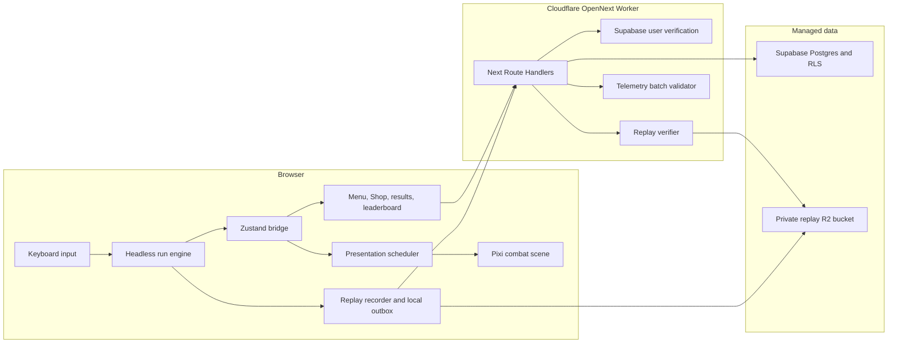

# TYPECADE: OVERDRIVE Technical Design Document

Date: 2026-08-09

Status: Proposed technical design after approved product direction

Target branch family: `feat/overdrive-*`

Related design: `docs/superpowers/specs/2026-08-09-overdrive-combat-competition-progression-design.md`

## 1. Purpose

This TDD defines the technical architecture for four releases:

1. M3 combat reliability, articulated animation, feedback clarity, accessibility, and performance.
2. M4 Daily Seed, authenticated attempt control, daily and endless leaderboards, and share integration.
3. M6 replay capture, verification, Ghost Race, Challenge Link, and anti-cheat.
4. Post-retention account levels, cosmetic currency, catalog purchases, inventory, and equipment.

The implementation plan that follows this TDD will split the work into reviewable PRs. This document defines module boundaries, interfaces, storage, security, failure behavior, and test gates.

## 2. Governing constraints

The implementation must obey these project rules:

- `docs/game-design.md` owns gameplay formulas, item effects, stage structure, economy, and MVP scope.
- `docs/prd.md` owns requirement IDs, priorities, architecture, data requirements, and milestones.
- `docs/design.md` owns visual tokens, layout values, animation timing, audio, and accessibility.
- Overdrive remains behind the `overdrive` feature flag and `/overdrive` route.
- Practice behavior remains unchanged.
- Engine code under `lib/engine/overdrive/` stays pure TypeScript with no React, PixiJS, DOM, Supabase, or Cloudflare imports.
- Game randomness continues through one seeded RNG. Game logic cannot call `Math.random()`.
- UI copy, identifiers, comments, tests, migrations, and commit messages use English.
- Engine changes receive Vitest tests before presentation polish.
- PixiJS owns gameplay motion. Framer Motion remains limited to menus and Shop.
- MVP excludes Firmware, Switch difficulty, the full unlock system, cosmetics, Copycat, and KERNEL PANIC.
- Post-retention progression cannot change score, Quota, item odds, prices, Glitches, or leaderboard access.

## 3. Requirement mapping

| Requirement | Technical owner in this TDD |
| --- | --- |
| F-1 to F-5 | Existing headless engine boundary, typed event contracts, version identity, tests |
| R-1 to R-7 | Existing engine state and new presentation truth contract |
| I-1 to I-4 | Existing item registry and deterministic item presentation scheduler |
| G-1 to G-2 | Existing engine and readable canvas states |
| J-1 | Presentation scheduler, rigs v2, combat choreography modules, object pools |
| J-2 | Audio event mixer and canonical event mapping |
| J-3 | Motion capability profile and alternate effects |
| D-1 | Server-owned Daily Seed and one authenticated attempt record |
| D-2 | Daily and endless leaderboard query services |
| D-3 | Share card enriched with verified competition data |
| D-4 | Versioned replay codec and R2 storage |
| D-5 | Replay player, Ghost Race, and Challenge Link |
| D-6 | Server replay verification and interval checks |
| A-1 | Local run persistence and submission outbox |
| A-2 | Existing Supabase Auth with server token verification |
| A-3 | Completed-run counter and deferred login prompt |
| Proposed A-4 | Post-retention non-power account level; becomes governing only after Task 27 amendment approval |
| Proposed A-5 | Post-retention play-earned cosmetic currency, catalog, and inventory; becomes governing only after Task 27 amendment approval |
| Proposed A-6 | Post-retention ranked-safe cosmetic equipment; becomes governing only after Task 27 amendment approval |

## 4. Current architecture and gaps

### 4.1 Current client flow

`features/overdrive/store.ts` constructs the headless run, subscribes to engine events, copies snapshots into Zustand, emits presentation events, and sends typed telemetry events. `features/overdrive/presentation/events.ts` stores the last 96 events in a module-level array. `CombatScene` and `CombatDirector` consume those events.

The flow has four gaps:

- `AnimationController` owns a two-contact pending queue and can emit contact without a corresponding contact pose.
- `CombatDirector` owns another pending-contact queue and discards old entries after its cap.
- `CombatScene` and `CombatDirector` recreate command-rail and signal-node objects during the input hot path.
- One class controls actors, target transitions, root travel, pressure attacks, Aegis, item effects, integrity drawing, popups, and Overdrive.

### 4.2 Current backend flow

The repository has browser and server Supabase factories, browser auth state, a Practice leaderboard RPC, and no checked-in Supabase migrations. Overdrive creates the Daily Seed from the browser UTC date. It stores runs and personal bests in local storage. It does not claim Daily attempts, submit Overdrive runs, verify replays, or expose an Overdrive leaderboard.

The current server Supabase factory uses a public key without a user session. Existing code also uses unsafe double casts around ungenerated RPC types. The TDD adds generated database types and server-only administration without rewriting Practice in the first combat PRs.

### 4.3 Current deployment

The project deploys Next.js 16 through `@opennextjs/cloudflare` to one Cloudflare Worker. `wrangler.jsonc` points at `.open-next/worker.js`, enables `nodejs_compat`, serves `.open-next/assets`, and enables observability. `package.json` already contains `build:worker`, `preview`, `deploy`, and `cf-typegen`.

The architecture will keep one OpenNext Worker. Next Route Handlers provide the Overdrive API. Cloudflare Pages must not own the production custom domain after Worker migration.

## 5. Target system context



## 6. Architecture decisions

### ADR-1: One OpenNext Worker

All API routes remain inside the Next.js application. A separate Worker would duplicate auth, routing, deployment, and observability. Daily Seed creation uses a persisted first-request transaction, so this design does not need a scheduled handler.

The Worker configuration keeps:

- `main: .open-next/worker.js`
- `nodejs_compat`
- static asset binding
- Worker self-reference required by OpenNext
- observability

M6 adds one private R2 binding named `OVERDRIVE_REPLAYS`. `npm run cf-typegen` regenerates `CloudflareEnv` after that binding changes.

### ADR-2: Semantic presentation scheduler

The engine emits semantic facts. A new scheduler owns visual timing and load shedding. Critical events retain their identity and order. Tactical events may aggregate. Decorative events may skip under load.

Animation clips stop owning the semantic contact queue. A blocked full-body clip cannot suppress the contact cue.

### ADR-3: Pose-centric rig authoring

Rig authors define whole-body poses. A compiler converts poses into part tracks for runtime interpolation. Validation counts authored poses, checks part groups, checks markers, and rejects invalid clips during tests.

This model lets a reviewer inspect one complete pose at a time. It also preserves the existing `RigInstance` interpolation approach.

### ADR-4: Supabase Data API with route-owned privileged writes

The browser can read public leaderboard data and user-owned rows through RLS. Run claims, result finalization, verification state, leaderboard publication, XP grants, and currency grants pass through server routes.

The server validates the Supabase user token with a publishable key. It uses a service-role client for operations that cross RLS boundaries. The service-role key stays in a Cloudflare secret and never uses a `NEXT_PUBLIC_` name.

The Worker does not open a direct Postgres connection. Hyperdrive becomes relevant if a later design replaces Supabase Data API calls with `pg` or another direct driver.

`docs/prd.md` section 4 currently describes authenticated users inserting their own run rows through RLS. Route-owned writes are a deliberate tightening of that boundary so clients cannot choose verification or publication state. The PRD must record this accepted amendment before the competition migration lands; until then, ADR-4 is a proposed TDD decision rather than permission to contradict the governing PRD.

### ADR-5: R2 replay storage

M6 stores compressed replay blobs in a private R2 bucket through the Worker binding. Postgres stores replay metadata and the object key. The browser cannot receive an R2 credential or write to the bucket.

### ADR-6: Local-first outbox

Free runs and previously cached same-day anonymous Daily conditions remain playable without the network. Authenticated ranked Daily attempts require a server claim before gameplay starts. Completed submissions enter a local outbox with an idempotency key until the server accepts or rejects them.

### ADR-7: Progression releases after the product gate

The code can define versioned level curves and catalog schemas before launch. UI, grants, wallet writes, and equipment remain disabled until the approved retention and performance gates pass.

## 7. Target module layout

### 7.1 Engine and replay

```text
lib/engine/overdrive/
  events.ts                         engine event types split from snapshot types
  types.ts                          run snapshot and domain types
  run.ts                            run state machine orchestration
  run-state.ts                      state construction, snapshot, save migration
  run-input.ts                      feed, backspace, submit, Overdrive input
  run-lifecycle.ts                  stage, Shop, standard clear, endless, run over
  run-shop.ts                       buy, sell, reroll, Macro dispatch
  run-telemetry-data.ts             pure derived measurements, no transport
  replay/
    types.ts                        ReplayHeaderV1 and ReplayInputV1
    recorder.ts                     pure delta recorder
    codec.ts                        binary encode and decode
    verifier.ts                     deterministic engine replay and summary match
    __tests__/
```

The implementation may split `run.ts` only when characterization tests cover the current public API. `createRun()` remains the exported entry point.

### 7.2 Presentation and canvas

```text
features/overdrive/presentation/
  events.ts                         presentation event union and event source
  scheduler.ts                      event-to-beat scheduling and aggregation
  scheduler-policy.ts               priority and budget policy
  scheduler-types.ts                PresentationBeat and scheduler contracts
  telemetry.ts                      latency and dropped-decoration aggregation
  __tests__/

features/overdrive/canvas/
  combat-scene.ts                   root scene lifecycle and composition
  command-rail.ts                   persistent glyph and equation objects
  scene-feedback.ts                 shake, hitstop, quota, typo, Overdrive rim
  choreography/
    combat-director.ts              small orchestration facade
    target-roster.ts                active, upcoming, distant, retiring actors
    contact-ledger.ts               accepted input to visible contact reconciliation
    warden-travel.ts                deterministic root motion
    pressure-sequence.ts            anticipation, attack, block timing
    aegis-sequence.ts               rescue choreography
    overdrive-sequence.ts           ready and release choreography
  pools/
    actor-pool.ts
    signal-node-pool.ts
    text-pool.ts
    score-popup-pool.ts
  rig/
    rig-definition.ts
    rig-pose.ts
    rig-clip-compiler.ts
    rig-validator.ts
    animation-controller.ts
    manifests/
      warden.ts
      packet-stalker.ts
      needle-wraith.ts
      null-crown.ts
```

### 7.3 Competition and progression

```text
app/api/overdrive/
  daily/route.ts
  daily/attempt/route.ts
  runs/submit/route.ts
  leaderboards/daily/route.ts
  leaderboards/endless/route.ts
  telemetry/route.ts
  replays/[runId]/route.ts            M6
  progression/purchase/route.ts       post-retention

features/overdrive/competition/
  api.ts
  contracts.ts
  submission-outbox.ts
  use-daily-attempt.ts
  use-run-submission.ts
  components/

features/overdrive/meta/
  api.ts
  store.ts
  components/

lib/overdrive/server/
  auth.ts
  contracts.ts
  daily-service.ts
  run-service.ts
  leaderboard-service.ts
  replay-service.ts
  telemetry-service.ts
  progression-service.ts

lib/overdrive/meta/
  types.ts
  level-curve.ts
  rewards.ts
  catalog.ts
  simulator.ts
```

### 7.4 Platform and database

```text
lib/cloudflare/env.ts
lib/supabase/client.ts
lib/supabase/server-auth.ts
lib/supabase/admin.ts
lib/supabase/database.types.ts
supabase/config.toml
supabase/migrations/
supabase/tests/database/
cloudflare-env.d.ts
```

## 8. Engine and presentation contracts

### 8.1 Event identity

The engine event bus keeps synchronous delivery. The store bridge wraps each presentation event in an envelope:

```ts
export type PresentationEventEnvelope<T extends OverdrivePresentationEvent> = {
  sequence: number
  runId: string
  targetOrdinal: number
  emittedAtMs: number
  event: T
}
```

`sequence` increases within one browser run. `runId` identifies the local run instance. `emittedAtMs` uses `performance.now()` in the browser adapter and never enters scoring logic.

The engine types do not import this envelope.

### 8.2 Presentation beats

```ts
export type PresentationPriority = "critical" | "tactical" | "decorative"

export type PresentationBeat = {
  beatId: string
  sourceSequence: number
  targetOrdinal: number
  kind:
    | "contact-cue"
    | "rig-clip"
    | "target-hit"
    | "score-equation"
    | "item-proc"
    | "camera-response"
    | "audio-cue"
    | "ambient-effect"
  priority: PresentationPriority
  dueAtMs: number
  expiresAtMs: number | null
  payload: Readonly<Record<string, string | number | boolean>>
}
```

The scheduler exposes:

```ts
export interface PresentationScheduler {
  enqueue(envelope: PresentationEventEnvelope<OverdrivePresentationEvent>): void
  drain(nowMs: number): readonly PresentationBeat[]
  reset(runId: string): void
  snapshotHealth(): PresentationHealthSnapshot
}
```

### 8.3 Scheduling policy

The scheduler applies these rules in order:

1. Convert each critical event into at least one beat with no expiration.
2. Give accepted characters a `contact-cue` due within 50ms and a target reaction due within 90ms.
3. Allow a rig clip to start, blend, or skip recovery without changing the contact beats.
4. Aggregate repeated tactical item effects by `itemId`, contribution kind, and word-resolution sequence.
5. Limit score popups to the canonical three live objects.
6. Drop expired decorative beats before critical or tactical work.
7. Record decorative drops and late critical beats in the health snapshot.

`drain()` returns critical beats first, then tactical beats, then decorative beats. It preserves source order within each priority.

### 8.4 Contact ledger

`ContactLedger` records one entry for each accepted character:

```ts
export type ContactRecord = {
  sequence: number
  targetOrdinal: number
  characterIndex: number
  acceptedAtMs: number
  cueAtMs: number | null
  hitAtMs: number | null
  settled: boolean
}
```

The scene settles a record after both the Warden cue and target reaction render. The ledger reports an invariant failure when either beat misses its deadline. It keeps unsettled records and a bounded history of settled latency samples. It does not cap unsettled records at two.

### 8.5 Animation controller

`AnimationController` owns clip state and interpolation. It no longer owns pending semantic contacts.

```ts
export type ClipPlayResult =
  | { status: "started"; clip: AnimationClipName }
  | { status: "blended"; clip: AnimationClipName }
  | { status: "blocked"; activeClip: AnimationClipName }
  | { status: "missing"; clip: AnimationClipName }
```

The scheduler reacts to a blocked clip by preserving contact cues and requesting the next legal chain clip when recovery opens.

## 9. Rig authoring and validation

### 9.1 Pose-centric source format

Rig manifests use authored whole-body poses:

```ts
export type RigPoseMarker =
  | { type: "contact"; target: "active-enemy" }
  | { type: "foot-lock"; partId: string }
  | { type: "audio"; cue: string }
  | { type: "effect"; preset: string }

export type AuthoredRigPose = {
  atMs: number
  easing?: "linear" | "cubic-out" | "ease-out-back"
  root?: Partial<RigTransform>
  parts: Readonly<Record<string, Partial<RigTransform>>>
  markers?: readonly RigPoseMarker[]
}

export type AuthoredAnimationClip = {
  name: AnimationClipName
  durationMs: number
  loop: boolean
  priority: number
  requiresFullBody: boolean
  poses: readonly AuthoredRigPose[]
}
```

`compileRigClip()` converts the pose list into the current part-track runtime shape. It carries marker times into a marker index that the animation controller exposes as edges.

### 9.2 Validation rules

`validateRigDefinition()` returns structured errors with rig, clip, pose, and part identifiers. Tests fail on these conditions:

- a full-body action contains fewer than 8 or more than 12 authored poses
- pose times are not sorted or exceed the clip duration
- a part identifier does not exist
- a full-body Warden action omits support-leg, pelvis, torso, brace-arm, cannon-arm, or head motion across the clip
- an attack clip lacks anticipation, contact, follow-through, or recovery coverage
- a contact marker occurs after the canonical contact budget
- a foot-lock marker points at a non-foot part
- an enemy lacks locomotion, idle, anticipation, attack, hit, defeat, or special
- a default clip is absent

Idle clips may use fewer authored poses. They still require the class-specific articulation defined in `docs/design.md`.

### 9.3 Rig review tool

A development-only animation lab at `/overdrive/dev/animation-lab` provides:

- actor and clip selection
- pause, single-frame step, speed, and loop controls
- current pose number and marker display
- silhouette mode
- part pivot and parent overlays
- contact and foot-lock marker lines
- reduced-motion preview
- frame-time readout

The route requires the base Overdrive flag and `NODE_ENV !== "production"`. Production builds render `notFound()` for the route.

### 9.4 Visual regression

Playwright captures the lab at named marker poses. The test suite compares layout and silhouette screenshots at a fixed viewport and device scale. Numeric unit tests remain the source for timing and transforms. Screenshot updates require a reviewer to inspect all four actors.

## 10. Combat scene decomposition

### 10.1 CombatDirector facade

`CombatDirector` retains these responsibilities:

- own the child choreography modules
- route presentation beats
- pass scene state to modules
- update modules in a fixed order
- destroy modules in reverse ownership order

It stops drawing signal nodes, managing text, calculating popup trajectories, and owning attack-specific timers.

### 10.2 Fixed update order

Each Pixi tick runs:

1. return early for canonical hitstop while preserving the scheduler clock policy
2. drain presentation beats
3. update Warden travel and clip sampling
4. update target transitions and clip sampling
5. settle contact ledger records
6. update pressure, Aegis, and Overdrive sequences
7. update item effects and score popups
8. update scene feedback and ambient effects
9. record frame and latency samples

The scheduler uses elapsed real frame time. Engine timers continue through the existing game loop rules and Focus Pause behavior.

### 10.3 Target roster

`TargetRoster` owns active, upcoming, distant, retiring, and available actor slots. It preserves the deterministic lane table and one-active-plus-two-upcoming contract.

The roster exposes actor positions through read-only methods. Choreography modules cannot mutate its arrays.

### 10.4 Overdrive sequence

`OverdriveSequence` owns the canonical 260ms ready state and 320ms release. It coordinates:

- Warden `ready` and `overdrive` clips
- cannon core lock
- arena rim pulse
- charge-rail lock
- rising cue
- arena-crossing effect geometry
- 3px maximum camera shake
- snap-return afterimage

The sequence emits completion to the director. It never changes score or charge.

### 10.5 Pressure and Aegis sequences

`PressureSequence` owns the 240ms anticipation and 120ms attack. `AegisSequence` owns the 600ms rescue block, shield fracture, `+30S` callout, and recovery wave. Both receive engine facts and cannot resolve run outcomes.

## 11. Pixi object lifecycle and performance

### 11.1 Pool ownership

Each pool owns creation, reset, reuse, and destruction for one display-object class. A pool grows to the highest observed need within its documented cap and reuses objects afterward.

| Pool | Growth input | Live cap |
| --- | --- | --- |
| Signal nodes | active word length | active word length |
| Command-rail glyphs | active plus visible upcoming glyph count | current rail capacity |
| Score popups | score resolutions | 3 |
| Defeat fragments | defeat event | 18 per defeat within global effect cap |
| Combat effect graphics | tactical and decorative effects | shared 200-object cap |
| Enemy actors | active, upcoming, distant, and retiring overlap | measured fixed preload count |

No accepted-character handler may call `destroy()` or construct `Text`, `Graphics`, `Sprite`, or `Container`.

### 11.2 Command rail

`CommandRail` keeps persistent glyph objects and mutates text, tint, alpha, and transform. It owns the equation line and armed-item markers. A caret move changes existing objects.

The rail exposes one method:

```ts
render(state: CommandRailState): void
```

The method receives an immutable view. It performs no engine query and emits no gameplay event.

### 11.3 Signal nodes

`SignalNodePool.render(word, caretIndex, dirty)` activates the first `word.length` nodes, assigns positions, and hides the remaining capacity. It updates node state in place. A new word can grow capacity; later characters reuse it.

### 11.4 Performance measurement

`PresentationHealthCollector` records:

- frame duration histogram
- accepted-to-cue latency
- accepted-to-hit latency
- late critical beats
- tactical aggregation count
- decorative drop count
- peak live effect objects
- peak unsettled contacts
- object-pool growth events

It emits one aggregate at stage result and one at run result. It does not emit per-character network events.

The acceptance harness covers:

- 20, 40, 60, 90, and 120 WPM synthetic input
- maximum supported word length from the active pool
- tier-4 combo effects
- pressure attack during item triggers
- Aegis rescue
- Overdrive release
- reduced motion
- low-end viewport and device profile

## 12. Audio architecture

`sfx.ts` becomes a facade over three channels:

```ts
export type AudioChannel = "keystroke" | "sfx" | "music"

export type AudioSettings = {
  keystrokeVolume: number
  sfxVolume: number
  musicVolume: number
  switchVariant: "linear" | "tactile" | "clicky"
  muted: boolean
}
```

The mixer keeps the documented defaults of 50%, 70%, and 0%. MVP ships no music. It loads audio after the first input and keeps total MVP assets under the documented budget.

The mixer allows at most 16 simultaneous voices. At the cap, a new cue may evict the oldest lower-priority voice. It drops a new cue when no lower-priority voice exists. An ordinary keystroke can never evict Overdrive release, stage resolution, or accessibility-critical UI confirmation.

The presentation scheduler emits named audio cues. Gameplay modules do not call oscillators or audio files by event-specific side effect. Reduced motion does not mute audio; accessibility settings expose channel controls.

## 13. Run pacing simulation

The existing engine remains the simulation source. A new deterministic runner executes the canonical 8-zone structure across the documented skill profiles.

```ts
export type SimulatedPlayerProfile = {
  wpm: 1 | 5 | 10 | 12 | 13 | 20 | 40 | 60 | 90
  characterAccuracy: number
  shopPolicy: "none" | "first-affordable" | "synergy"
}

export type SimulationAggregate = {
  profile: SimulatedPlayerProfile
  sampleCount: number
  resolvedRuns: number
  medianDurationMs: number
  p90DurationMs: number
  deathByZone: Readonly<Record<number, number>>
  stageClearRate: Readonly<Record<string, number>>
  averageOverdriveReleases: number
  averageFirstPurchaseStage: number | null
}
```

The simulator models per-character accuracy, dirty words, corrections, Combo resets, item triggers, shop RNG, and Overdrive cadence. It cannot replace external playtests. A proposal to change zones, stages, clocks, Quotas, or item values starts with a GDD change.

## 14. Feature flags

The base flag remains `NEXT_PUBLIC_OVERDRIVE`.

Subfeatures use server-controlled rollout variables with matching public visibility flags when the browser needs to render navigation:

| Capability | Server variable | Public UI variable |
| --- | --- | --- |
| M4 competition | `OVERDRIVE_COMPETITIVE` | `NEXT_PUBLIC_OVERDRIVE_COMPETITIVE` |
| M6 replay and ghosts | `OVERDRIVE_REPLAY` | `NEXT_PUBLIC_OVERDRIVE_REPLAY` |
| Post-retention progression | `OVERDRIVE_META` | `NEXT_PUBLIC_OVERDRIVE_META` |

Each subfeature requires the base flag. Server routes return `404` when their server flag is off. The client hides links when the matching public flag is off. A client flag cannot authorize a server action.

## 15. Competition lifecycle

### 15.1 Anonymous run

An anonymous player can run Free, Practice, and Daily modes. Daily uses the server seed when reachable and a cached seed when the same seed response already exists. The UI labels the attempt `UNRANKED` and does not upload a result.

### 15.2 Authenticated Daily attempt

The client requests a Daily attempt before gameplay:

1. The server verifies the access token.
2. The service resolves the UTC date, language, ruleset, RNG, and word-pool versions.
3. The service reads or creates the persisted Daily Seed.
4. The database inserts one `started` run for the user and board identity.
5. A uniqueness constraint returns the existing attempt when the client retries.
6. The client stores the returned public run identifier with the local save.

Starting another Daily on the same board resumes the same unfinished attempt or shows the recorded result. It cannot create a second ranked run.

### 15.3 Free and endless submission

An authenticated Free run creates its server row at result submission. The client supplies a cryptographic idempotency key generated at run start. The server returns the existing result when the same key arrives again.

### 15.4 Submission states

```ts
export type RunStatus =
  | "started"
  | "submitted"
  | "accepted"
  | "verified"
  | "rejected"
```

- `started`: server claimed an authenticated Daily attempt.
- `submitted`: server stored a result and awaits M6 verification.
- `accepted`: M4 validation passed and the result can enter the provisional board.
- `verified`: M6 engine replay matched the submission.
- `rejected`: schema, identity, interval, or deterministic replay checks failed.

The UI names provisional and verified results. It does not call an accepted M4 result replay-verified.

## 16. HTTP API contracts

### 16.1 Common response

```ts
export type ApiSuccess<T> = { ok: true; data: T }

export type ApiFailure = {
  ok: false
  error: {
    code:
      | "FEATURE_DISABLED"
      | "UNAUTHENTICATED"
      | "FORBIDDEN"
      | "INVALID_REQUEST"
      | "ATTEMPT_EXISTS"
      | "VERSION_MISMATCH"
      | "RUN_NOT_FOUND"
      | "RUN_ALREADY_FINAL"
      | "REPLAY_MISMATCH"
      | "RATE_LIMITED"
      | "INTERNAL_ERROR"
    message: string
    retryable: boolean
  }
}
```

Routes validate `Content-Type`, body size, fields, enums, numeric bounds, and identifier format before service calls. Error messages contain no secret, SQL, stack, or user data.

### 16.2 `GET /api/overdrive/daily`

Query:

- `language=EN|ID`

Response:

```ts
export type DailySeedResponse = {
  date: string
  language: WordPoolLanguage
  seed: string
  rulesetVersion: string
  rngVersion: string
  wordPoolVersion: string
  resetAt: string
  rankedEligibility: "eligible" | "login-required" | "attempt-exists"
}
```

The route uses the server UTC date. It applies a short public cache that cannot cross the UTC reset boundary.

### 16.3 `POST /api/overdrive/daily/attempt`

Body:

```ts
export type ClaimDailyAttemptRequest = {
  language: WordPoolLanguage
  clientRunId: string
}
```

Success returns the seed identity, public run ID, status, and creation time. It requires authentication.

### 16.4 `POST /api/overdrive/runs/submit`

```ts
export type RunSubmissionV1 = {
  schemaVersion: 1
  clientRunId: string
  publicRunId: string | null
  mode: "daily" | "free"
  seed: string
  language: WordPoolLanguage
  rulesetVersion: string
  rngVersion: string
  wordPoolVersion: string
  clientVersion: string
  result: {
    win: boolean
    finalZone: number
    finalStage: StageType
    standardScore: number
    endlessScore: number
    finalScore: number
    durationMs: number
    accuracyBps: number
    averageWpmX100: number
    totalTypos: number
    maxCombo: number
    highestMult: number
    keycaps: readonly string[]
    macros: readonly string[]
  }
  replay: null | {
    codecVersion: 1
    sha256: string
    bytesBase64: string
  }
}
```

M4 accepts `replay: null`. M6 requires replay for ranked publication. The server checks all item IDs against the canonical manifest and validates inventory capacities.

### 16.5 Leaderboard reads

Routes:

- `GET /api/overdrive/leaderboards/daily`
- `GET /api/overdrive/leaderboards/endless`

Both accept `language`, `rulesetVersion`, `limit`, and an opaque cursor. Daily also accepts `date`. `limit` defaults to 25 and caps at 50.

Rows contain rank context, display name, score, zone, accuracy, WPM, build fingerprint, status, and run public ID. Pagination uses the score, finish time, and internal row ID as a keyset cursor. It does not use database `OFFSET`.

### 16.6 `POST /api/overdrive/telemetry`

The route accepts at most 50 bounded envelopes per request. The server discards unrecognized names and rejects payloads with typed word content or raw key values. The client batches stage and run aggregates with `sendBeacon` or a `fetch` request with `keepalive`.

### 16.7 M6 replay read

`GET /api/overdrive/replays/[runId]` returns replay metadata and a streamed body to the replay owner or for a run already published as `verified` on a public leaderboard. An unverified or unpublished replay stays private. A Challenge Link carries versioned run conditions and a target score; it does not grant replay access. The route never exposes the bucket binding or object key.

### 16.8 Post-retention purchase

`POST /api/overdrive/progression/purchase` accepts one catalog item ID. The server calls the atomic purchase function and returns the balance, inventory entry, and ledger entry.

## 17. Supabase schema

### 17.1 Schema conventions

- Tables use lowercase snake case.
- Internal primary keys use `bigint generated always as identity`.
- Public shareable identifiers use unique UUIDs.
- Timestamps use `timestamptz`.
- Scores and durations use integer types.
- Accuracy uses basis points from 0 to 10,000.
- WPM uses hundredths to avoid floating comparison drift.
- Foreign-key columns receive indexes.
- Exposed tables enable RLS.
- Client roles receive explicit grants.
- Views use `security_invoker = true` when they depend on RLS-protected base rows.

### 17.2 `daily_seeds`

```sql
create table public.daily_seeds (
  id bigint generated always as identity primary key,
  run_date date not null,
  language text not null check (language in ('EN', 'ID')),
  ruleset_version text not null,
  rng_version text not null,
  word_pool_version text not null,
  seed text not null,
  created_at timestamptz not null default now(),
  unique (run_date, language, ruleset_version)
);
```

`anon` and `authenticated` receive read access. Server routes own insert. The server generates the seed with Web Crypto and persists the winning insert during a race.

### 17.3 `runs`

```sql
create table public.runs (
  id bigint generated always as identity primary key,
  public_id uuid not null default gen_random_uuid() unique,
  client_run_id uuid not null,
  user_id uuid references auth.users(id) on delete set null,
  mode text not null check (mode in ('daily', 'free')),
  status text not null check (status in ('started', 'submitted', 'accepted', 'verified', 'rejected')),
  run_date date,
  seed text not null,
  language text not null check (language in ('EN', 'ID')),
  ruleset_version text not null,
  rng_version text not null,
  word_pool_version text not null,
  client_version text not null,
  win boolean,
  final_zone smallint check (final_zone between 1 and 32767),
  final_stage text check (final_stage in ('warmup', 'rush', 'glitch')),
  standard_score bigint check (standard_score >= 0),
  endless_score bigint check (endless_score >= 0),
  final_score bigint check (final_score >= 0),
  duration_ms integer check (duration_ms >= 0),
  accuracy_bps smallint check (accuracy_bps between 0 and 10000),
  average_wpm_x100 integer check (average_wpm_x100 >= 0),
  total_typos integer check (total_typos >= 0),
  max_combo integer check (max_combo >= 0),
  highest_mult integer check (highest_mult >= 1),
  build jsonb not null default '{"keycaps":[],"macros":[]}'::jsonb,
  replay_sha256 text,
  rejection_code text,
  started_at timestamptz not null default now(),
  submitted_at timestamptz,
  verified_at timestamptz,
  created_at timestamptz not null default now(),
  updated_at timestamptz not null default now(),
  unique (user_id, client_run_id),
  check ((mode = 'daily' and run_date is not null) or (mode = 'free' and run_date is null))
);
```

The Daily uniqueness rule uses a partial unique index:

```sql
create unique index runs_one_daily_attempt_idx
on public.runs (user_id, run_date, language, ruleset_version)
where mode = 'daily' and user_id is not null;
```

Additional indexes follow query and RLS access:

```sql
create index runs_user_created_idx
on public.runs (user_id, created_at desc, id desc);

create index runs_daily_board_idx
on public.runs (run_date, language, ruleset_version, final_score desc, submitted_at, id)
where mode = 'daily' and status in ('accepted', 'verified');

create index runs_endless_board_idx
on public.runs (language, ruleset_version, endless_score desc, submitted_at, id)
where mode = 'free' and endless_score > 0 and status in ('accepted', 'verified');
```

RLS lets authenticated users read their rows. Browser roles cannot insert, update, or delete `runs`. Server routes use the service-role client.

### 17.4 `leaderboard_entries`

`leaderboard_entries` contains public-safe fields and gives the API a stable keyset query without exposing complete run rows.

```sql
create table public.leaderboard_entries (
  id bigint generated always as identity primary key,
  run_id bigint not null references public.runs(id) on delete cascade unique,
  run_public_id uuid not null unique,
  user_id uuid not null references auth.users(id) on delete cascade,
  display_name text not null,
  board text not null check (board in ('daily', 'endless')),
  board_date date,
  language text not null check (language in ('EN', 'ID')),
  ruleset_version text not null,
  score bigint not null check (score >= 0),
  final_zone smallint not null,
  accuracy_bps smallint not null check (accuracy_bps between 0 and 10000),
  average_wpm_x100 integer not null check (average_wpm_x100 >= 0),
  build_fingerprint jsonb not null,
  verification_state text not null check (verification_state in ('accepted', 'verified')),
  finished_at timestamptz not null,
  created_at timestamptz not null default now(),
  check ((board = 'daily' and board_date is not null) or (board = 'endless' and board_date is null))
);
```

Daily entries have one row per user and board identity. Endless publication uses an atomic upsert that replaces the row only when the submitted score beats the stored score. Indexes match the keyset order.

The server copies the current public display name into the entry. Profile edits do not require privileged leaderboard joins. A later maintenance job can update historical names if product policy requires it.

### 17.5 `replays`

```sql
create table public.replays (
  id bigint generated always as identity primary key,
  run_id bigint not null references public.runs(id) on delete cascade unique,
  user_id uuid references auth.users(id) on delete set null,
  codec_version smallint not null,
  storage_key text not null unique,
  byte_length integer not null check (byte_length > 0),
  input_count integer not null check (input_count >= 0),
  sha256 text not null,
  verification_state text not null check (verification_state in ('pending', 'verified', 'rejected')),
  verification_code text,
  created_at timestamptz not null default now(),
  verified_at timestamptz
);

create index replays_user_id_idx on public.replays (user_id);
```

Authenticated users can read their replay metadata. They cannot insert or mutate it through the Data API.

### 17.6 `product_events`

```sql
create table public.product_events (
  id bigint generated always as identity primary key,
  event_name text not null,
  event_version smallint not null,
  anonymous_session_id uuid,
  user_id uuid references auth.users(id) on delete set null,
  run_public_id uuid,
  occurred_at timestamptz not null,
  received_at timestamptz not null default now(),
  payload jsonb not null,
  check (jsonb_typeof(payload) = 'object')
);

create index product_events_name_received_idx
on public.product_events (event_name, received_at desc, id desc);

create index product_events_user_received_idx
on public.product_events (user_id, received_at desc, id desc)
where user_id is not null;
```

Browser roles have no table access. The telemetry route inserts bounded, validated events. A scheduled retention policy can remove raw rows after the analytics window once the team chooses that window in the privacy policy.

### 17.7 Progression tables

Post-retention migrations create:

- `overdrive_progression`: one row per user with level, current XP, lifetime XP, cosmetic balance, and version.
- `cosmetic_catalog`: stable item ID, category, rarity label, exact price, availability, asset identity, and compatibility version.
- `cosmetic_inventory`: one unique user and cosmetic pair with acquisition source and timestamp.
- `cosmetic_equipment`: one equipped cosmetic per user and slot.
- `progression_ledger`: immutable XP and currency deltas tied to a source and idempotency key.

The ledger carries a uniqueness constraint on `(user_id, idempotency_key)`. The balance row stores the current projection for fast reads. Database functions update the ledger, balance, and inventory in one transaction.

### 17.8 Public views

`leaderboard_daily` and `leaderboard_endless` use `security_invoker = true` over `leaderboard_entries`. The base table exposes public read and contains no email, auth metadata, replay path, rejection reason, or private run details.

## 18. Supabase access control

### 18.1 Grant matrix

| Object | `anon` | `authenticated` | Service role |
| --- | --- | --- | --- |
| `daily_seeds` | select | select | full |
| `runs` | none | select own through RLS | full |
| `leaderboard_entries` | select | select | full |
| `replays` | none | select own metadata | full |
| `product_events` | none | none | full |
| `overdrive_progression` | none | select own | full |
| `cosmetic_catalog` | select active | select active | full |
| `cosmetic_inventory` | none | select own | full |
| `cosmetic_equipment` | none | select and update own valid slots | full |
| `progression_ledger` | none | select own | full |

Each exposed table enables RLS. Policies wrap `auth.uid()` in `select` and index `user_id`.

### 18.2 Server clients

`lib/supabase/server-auth.ts` creates a request-scoped client with the project URL and publishable key. It validates the bearer token with `auth.getUser(token)`. It does not trust `user_metadata` for authorization.

`lib/supabase/admin.ts` imports `server-only`, reads the service-role key from the Worker environment, disables browser auth persistence, and exists in server modules. Route handlers derive `user_id` from the verified user and ignore user identifiers from request bodies.

### 18.3 Database functions

Atomic functions follow these rules:

- set `search_path = ''`
- qualify every table
- revoke execute from `PUBLIC`
- grant only the intended role
- check `auth.uid()` inside authenticated self-service functions
- omit a caller-supplied `user_id` from cosmetic purchase
- return a typed row rather than dynamic SQL
- use advisory or row locks only around the small wallet transaction

`purchase_overdrive_cosmetic(cosmetic_id text)` may use `security definer` because it performs one authenticated atomic wallet transaction. The migration revokes default execution, grants `authenticated`, checks `(select auth.uid())`, and records one ledger idempotency key. Server-only grant functions remain unavailable to browser roles.

## 19. Authentication and session transport

The first competition release keeps the existing browser Supabase session to protect Practice behavior. The competition API adds an explicit bearer token:

1. `competition/api.ts` calls `client.auth.getSession()`.
2. It sends `Authorization: Bearer <access_token>` to the same-origin route.
3. The route calls `auth.getUser(token)` before any privileged operation.
4. The route passes the verified UUID to the service layer.

The browser never sends `user_id` as authority. The service-role client never reaches a client component.

Environment migration supports the existing `NEXT_PUBLIC_SUPABASE_ANON_KEY` during one compatibility release and adds `NEXT_PUBLIC_SUPABASE_PUBLISHABLE_KEY`. New code prefers the publishable key. The project can remove the legacy variable after production uses the new key.

## 20. Replay format and verification

### 20.1 Replay input

```ts
export type ReplayInputKind =
  | "character"
  | "backspace"
  | "submit"
  | "overdrive"
  | "macro"

export type ReplayInputV1 = {
  deltaMs: number
  kind: ReplayInputKind
  value: string | number | null
}

export type ReplayHeaderV1 = {
  codecVersion: 1
  seed: string
  mode: "daily" | "free"
  language: WordPoolLanguage
  rulesetVersion: string
  rngVersion: string
  wordPoolVersion: string
  clientVersion: string
}
```

The recorder captures input intent and elapsed milliseconds. It does not record presentation events. It records printable characters because deterministic replay requires them. Telemetry does not receive those characters.

### 20.2 Codec

The binary codec writes:

1. a small versioned header
2. varint delta times
3. one-byte input kinds
4. UTF-8 character payloads or Macro indices where required

The decoder rejects unsupported versions, truncated input, negative or excessive deltas, invalid UTF-8, invalid kinds, and input counts above the configured run bound.

The client hashes the final bytes with SHA-256. The server recalculates the hash before R2 storage.

### 20.3 Verification

The server verifier:

1. loads the canonical word pool and engine version
2. creates a run from the replay header
3. advances the engine by each delta
4. applies the input through public engine methods
5. compares final score, zone, stage, duration, accuracy, WPM, typo count, Combo, Mult, build, and win state
6. checks interval rules for impossible input patterns
7. records a structured verification code
8. publishes or updates the leaderboard entry on success

Verification uses the shared engine. It has no Pixi, React, DOM, or browser dependencies.

### 20.4 R2 object keys

The server creates object keys from server-owned identifiers:

`overdrive/replays/v1/<ruleset-version>/<run-public-id>.bin`

The route validates ownership before streaming a replay. It sets an explicit content type and streams `object.body` rather than buffering unknown content.

## 21. Submission outbox and failure handling

`SubmissionOutbox` persists bounded entries in IndexedDB. Small status projections may be mirrored into local storage for synchronous Run Over rendering, but serialized submission or replay bodies belong only in IndexedDB:

```ts
export type SubmissionOutboxEntry = {
  clientRunId: string
  createdAt: string
  attempts: number
  nextAttemptAt: string
  submission: RunSubmissionV1
  lastErrorCode: ApiFailure["error"]["code"] | null
  state: "queued" | "submitting" | "accepted" | "verified" | "rejected"
}
```

Rules:

- keep one entry per `clientRunId`
- retry network and server `5xx` failures with capped exponential delay
- stop on invalid request, version mismatch, final rejection, or authorization failure
- preserve a claimed Daily attempt across reloads
- limit automatic retries to the current session and user-triggered resume afterward
- remove an entry after idempotent success
- show pending, accepted, verified, and rejected states on Run Over

The outbox does not retry a rejected Daily as a new attempt.

## 22. Leaderboard queries and caching

### 22.1 Daily query

The query filters equality columns first:

- board = `daily`
- board date
- language
- ruleset version

It orders by score descending, finish time ascending, and ID ascending. The keyset cursor encodes those three order values. The API signs or validates cursor structure so arbitrary cursor data cannot alter the SQL shape.

### 22.2 Endless query

The endless query filters board, language, ruleset version, and positive endless score. It keeps one best entry per user through the publication upsert.

### 22.3 Cache policy

- Current Daily page: short public cache with stale-while-revalidate bounded by the next reset.
- Historical Daily page: longer immutable-style cache after the date closes.
- Endless page: short public cache.
- Current-user context and `Around You`: private, no shared cache.

Route responses include the board identity and ruleset version so clients cannot merge incompatible rows.

## 23. Telemetry transport and privacy

### 23.1 Browser transport

`TelemetryTransport` subscribes to the current `typecade:telemetry` browser event, validates its own typed envelope, and buffers events. It flushes on:

- stage result
- run result
- 20 queued events
- page visibility change to hidden

The browser sends aggregate latency histograms. It does not send typed words, printable keys, email, access tokens, replay bytes, or raw frame-by-frame traces.

### 23.2 Event versions

Each event carries `eventVersion`. The server accepts a declared allowlist. Breaking payload changes increment the event version instead of mutating historical meaning.

### 23.3 Worker behavior

The route validates at most 50 events, derives authenticated user identity when available, inserts bounded rows, and emits structured error logs. It handles all Promises through `await`, return, or the supported post-response mechanism. It stores no request-scoped state in module globals.

## 24. Account progression

### 24.1 Release gate

`OVERDRIVE_META` remains off until one version-matched cohort satisfies every product and operational gate:

- M4 works end to end.
- first-run resolution is at least 60%.
- second-run rate is at least 35%.
- D1 retention is at least 20%.
- D7 retention is at least 8%.
- share rate is at least 10%.
- the agreed low-end device sustains at least 55 FPS.
- p95 input acknowledgement is at most 50ms.
- p95 visible contact is at most 90ms.
- crash-free run rate is at least 99.5%.
- replay verification succeeds for at least 99.0% of otherwise eligible, version-supported ranked submissions.

The gate report records the cohort window, sample size, build/ruleset versions, exclusions, numerators, denominators, confidence intervals, low-end device profile, and verification failure categories. Missing or mixed-version data cannot pass. Meeting the numbers authorizes a GDD amendment review; it does not authorize the implementation to invent currency, grant, price, or achievement values.

### 24.2 Pure level curve

`lib/overdrive/meta/level-curve.ts` exports versioned pure functions:

```ts
export type LevelCurveVersion = "v1"

export function totalXpForLevel(
  level: number,
  version: LevelCurveVersion,
): number

export function levelForTotalXp(
  totalXp: number,
  version: LevelCurveVersion,
): { level: number; xpIntoLevel: number; xpForNextLevel: number }
```

The first implementation must simulate the approved targets before the progression flag opens. The curve cannot consume WPM as a direct grant multiplier.

### 24.3 Reward calculation

`calculateRunRewards()` receives an immutable verified run summary and achievement grants. It returns XP and currency entries with stable source identifiers. Replaying the same run produces the same idempotency key and cannot grant twice.

Run Tokens never enter this API. They remain an in-run economy.

### 24.4 Catalog and ownership

The cosmetic catalog uses stable IDs and a versioned JSON or TypeScript manifest mirrored into Postgres. Code maps each ID to approved assets and ranked-safe capability metadata.

```ts
export type CosmeticSlot =
  | "warden-material"
  | "cannon-effect"
  | "caret"
  | "arena-colorway"
  | "profile-frame"
  | "title"
  | "sound-pack"

export type CosmeticDefinition = {
  id: string
  slot: CosmeticSlot
  name: string
  price: number
  catalogVersion: number
  reducedMotionSafe: boolean
  rankedSafe: boolean
}
```

The UI cannot equip an item when either safety flag is false. The server validates ownership and slot compatibility.

### 24.5 Purchase transaction

The database purchase function:

1. resolves `(select auth.uid())`
2. locks the progression row
3. reads an active catalog item
4. rejects existing ownership
5. checks balance
6. inserts the inventory row
7. inserts the negative currency ledger entry
8. updates the projected balance
9. returns the new balance and inventory row

Exact prices and grant values require a GDD amendment before the progression implementation PR.

## 25. Security design

### 25.1 Threats and controls

| Threat | Control |
| --- | --- |
| User submits another user ID | Server derives user from verified token |
| Service key leaks to browser | `server-only` module, Cloudflare secret, bundle check |
| Multiple Daily attempts | Partial unique index and idempotent claim |
| Client submits inflated score | M4 schema and identity validation; M6 deterministic replay |
| Replay object enumeration | Server-owned UUID path and authorized route |
| Replay parser abuse | Body cap, input cap, codec version, bounded deltas |
| SQL injection | Fixed Supabase queries and typed RPC parameters |
| RLS bypass through view | Public-safe base table and `security_invoker` views |
| Public function privilege | Revoke `PUBLIC`; explicit role grant; fixed search path |
| Duplicate reward | Ledger idempotency constraint |
| Currency race | Atomic row lock and transaction function |
| Cursor manipulation | Strict cursor parser and fixed query order |
| Telemetry privacy leak | Event allowlist and forbidden key scan |
| Cross-request Worker leak | No request state in module globals |

### 25.2 Request bounds

Each route declares a body-size bound, item-count bound, string-length bound, and numeric range. The route returns `413` for excessive bodies and `400` for invalid fields. It returns `401` for absent or invalid authentication and `409` for final-state conflicts.

Application-level limits are deliberately smaller than platform limits:

| Request | Maximum encoded body | Additional cap |
| --- | ---: | --- |
| Daily attempt claim | 2,048 bytes | one request object |
| Run submission | 393,216 bytes | replay bytes at most 262,144; at most 20,000 inputs |
| Telemetry batch | 65,536 bytes | at most 50 envelopes |
| Cosmetic purchase | 2,048 bytes | one catalog item ID |

Replay codec v1 also rejects a single input delta above 300,000ms. These are validation limits, not gameplay tuning values. Increasing one requires a TDD change, hostile-input tests, and a Worker memory review.

### 25.3 Rate limiting

M4 uses two Cloudflare Workers Rate Limiting bindings inside the existing OpenNext Worker:

| Binding | Namespace ID | Limit | Key |
| --- | --- | --- | --- |
| `OVERDRIVE_WRITE_RATE_LIMITER` | `32026081` | 12 calls per 60 seconds | verified user ID plus route family |
| `OVERDRIVE_TELEMETRY_RATE_LIMITER` | `32026082` | 30 calls per 60 seconds | validated anonymous session ID or verified user ID |

Daily attempt, run submission, and post-retention purchase use the write limiter after authentication and before reading a large request body. Telemetry validates its bounded envelope/session identity before calling the telemetry limiter and before database insertion. Public cached Daily and leaderboard reads do not use these bindings in the first release.

The limiter returns the common `RATE_LIMITED` error with HTTP `429`. Binding counters are permissive, eventually consistent, and local to a Cloudflare location, so database uniqueness, idempotency, validation, and RLS remain the correctness controls. Workers Observability tracks `429` counts. A WAF rule may be added after measuring production traffic, especially for rotating anonymous-session abuse; the initial release does not default to IP-only application limits that could penalize shared mobile networks.

## 26. Accessibility design

The canvas maintains a DOM status mirror for critical state:

- current target word and caret position
- score equation after submission
- Overdrive ready state and release command
- Aegis state and rescue
- enemy pressure warning
- stage and run result

The status mirror uses restrained live-region announcements. It does not announce each accepted character for screen-reader users who already hear their keyboard input.

The implementation tests:

- keyboard-only menu, run, pause, Shop, result, and leaderboard paths
- 14px compact HUD floor
- 44px controls
- focus visibility
- reduced motion
- color-independent critical states
- channel-specific audio controls
- 200% zoom for DOM surfaces

## 27. Testing strategy

### 27.1 Unit tests

Vitest covers:

- scheduler priority, ordering, aggregation, and critical no-drop invariant
- contact deadline accounting
- rig clip compilation and validation
- animation cancellation and marker edges
- pool reuse and reset
- replay recording, codec round trip, malformed input, and deterministic verification
- API request parsers and cursor codec
- level curve and reward idempotency
- catalog slot and safety validation

### 27.2 Engine characterization

Before splitting `run.ts`, tests record public behavior for:

- startup and beginner route
- accepted character and typo events
- Space and Enter submission by zone
- Overdrive automatic and held release
- stage clear and fail
- Shop transitions
- state export and load
- deterministic RNG after save and resume

### 27.3 Database tests

pgTAP tests cover:

- one Daily attempt uniqueness
- user-owned run read policy
- blocked client run writes
- public leaderboard reads
- hidden replay storage keys
- idempotent leaderboard publication
- best-only endless upsert
- reward idempotency
- atomic purchase, insufficient funds, duplicate ownership, and slot rules

`supabase db lint --local --level warning --fail-on error` and database advisors run before schema completion.

### 27.4 Route tests

Route handler tests inject fake auth and service adapters. They cover authentication, body bounds, version mismatch, idempotency, conflict, safe errors, and service failure.

No route test calls a production Supabase project.

### 27.5 Browser tests

Playwright covers:

- Play visible at 390 by 844
- first-key contract
- rapid input without missing visual contact counters
- Overdrive ready and release state
- reduced-motion replacement feedback
- Daily eligibility and claim states
- offline result outbox
- accepted and verified Run Over states
- leaderboard pagination and current-user row
- deferred login prompt after three finished runs
- cosmetic purchase and equip after the flag opens

### 27.6 Worker preview tests

CI runs API and smoke tests against `npm run preview` because local `next dev` uses Node.js while production uses workerd. The pipeline also runs `npm run cf-typegen`, TypeScript, lint, Vitest, the OpenNext build, and selected Playwright tests.

## 28. Observability

Worker logs use structured JSON fields:

- `requestId`
- `route`
- `method`
- `status`
- `durationMs`
- `userIdHash`
- `runPublicId`
- `errorCode`
- `rulesetVersion`

Logs omit tokens, email, replay content, typed content, service keys, and raw request bodies.

Dashboards or queries track:

- Daily seed creation conflicts
- claim and submit success rate
- duplicate idempotency hits
- verification queue time and failure code
- leaderboard query latency
- telemetry rejection rate
- p95 accepted-to-cue and accepted-to-hit latency
- low-end frame health
- progression grant and purchase failures

## 29. Migration and rollout

### Phase 0: Characterization and infrastructure

- Add engine characterization tests.
- Add scheduler contracts without changing visuals.
- Initialize local Supabase migrations and generated database types.
- Add server environment adapters and route test harness.

### Phase 1: M3 combat reliability

- Replace contact queues with the scheduler and ledger.
- Introduce object pools.
- Split CombatDirector.
- Introduce pose-centric rig manifests and animation lab.
- Rebuild Warden and enemy clips.
- Complete Overdrive, Combo, score, item, audio, mobile, and accessibility work.
- Pass stress and low-end gates.

### Phase 2: M4 competition

- Create Daily Seed, run, leaderboard, and telemetry schema.
- Add Daily query and attempt claim.
- Add submission outbox and provisional result publication.
- Add Overdrive leaderboard route and UI.
- Enrich share cards with competition identity.

### Phase 3: M6 replay and social

- Add replay recorder and codec.
- Add R2 binding and generated Worker types.
- Add deterministic verifier.
- Require replay for ranked publication.
- Add Ghost Race and Challenge Link.
- Add deferred login prompt after three finished runs.

### Phase 4: Post-retention progression

- Confirm product gates.
- Amend GDD with currency name, curve, grants, prices, achievements, and catalog.
- Add progression schema and atomic functions.
- Add XP, wallet, catalog, inventory, equipment, and profile surfaces.
- Roll out behind `OVERDRIVE_META`.

## 30. Rollback strategy

- Base feature flag hides the entire mode.
- Competition flag hides routes and UI while local play continues.
- Replay flag returns boards to accepted M4 submissions if product policy permits that fallback.
- Meta flag hides grants, wallet, catalog, and equip paths without deleting ownership data.
- Migrations add new tables and columns before code depends on them.
- Destructive migrations require a later release after old code stops reading the data.
- Ruleset and codec versions allow old run and replay rows to remain readable.

## 31. Technical acceptance gates

### M3

- No accepted character lacks a reconciled cue and hit record.
- p95 cue begins within 50ms and p95 contact occurs within 90ms on the agreed low-end device.
- No accepted-character hot path creates or destroys Pixi display objects after pool warmup.
- Warden and enemy full-body actions pass rig validation.
- Overdrive and stage-clear camera response match canonical bounds.
- Mobile Play appears in the first 390 by 844 viewport.
- Compact HUD text uses at least 14px.
- Reduced motion preserves combat state and score causality.

### M4

- The server owns Daily date and seed identity.
- One authenticated user cannot create a second Daily attempt for one board identity.
- Submission retries return the same run.
- Daily and endless queries use keyset pagination.
- Leaderboard rows expose no private run or auth data.
- Local and provisional records carry accurate labels.
- `npm run preview` passes the competition smoke tests.

### M6

- Replay round trips preserve each input and delta.
- The shared engine reproduces accepted result summaries.
- Modified replay bytes or summaries fail verification.
- R2 objects remain private and stream through authorized routes.
- Ghost Race cannot change the active run engine or score.

### Post-retention

- Every product and operational threshold in section 24.1 passes on one version-matched cohort before flag enablement.
- A run grants XP and currency once.
- A purchase updates ledger, balance, and inventory atomically.
- Cosmetics preserve ranked silhouettes, telegraphs, timing, particles, and reduced-motion behavior.
- Account level grants no gameplay power.

## 32. Current documentation references

- [Cloudflare Next.js on Workers](https://developers.cloudflare.com/workers/framework-guides/web-apps/nextjs/)
- [Cloudflare Workers best practices](https://developers.cloudflare.com/workers/best-practices/workers-best-practices/)
- [Cloudflare Workers Rate Limiting binding](https://developers.cloudflare.com/workers/runtime-apis/bindings/rate-limit/)
- [OpenNext Cloudflare adapter](https://opennext.js.org/cloudflare)
- [OpenNext database access and request-scoped clients](https://opennext.js.org/cloudflare/howtos/db)
- [Supabase RLS](https://supabase.com/docs/guides/database/postgres/row-level-security)
- [Supabase API security](https://supabase.com/docs/guides/api/securing-your-api)
- [Supabase query optimization](https://supabase.com/docs/guides/database/query-optimization)
- [Supabase Auth with Next.js](https://supabase.com/docs/guides/auth/quickstarts/nextjs)

## 33. Plan handoff

The implementation plan must use this TDD as its interface source. A task that changes an API, table, type, flag, or module name must update this TDD in the same PR or receive design approval first.
